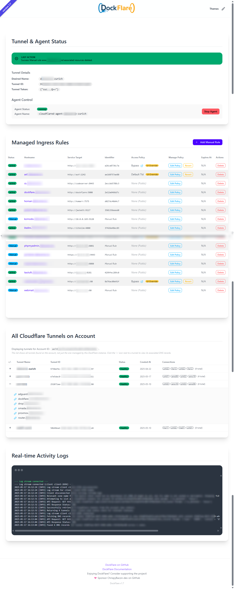
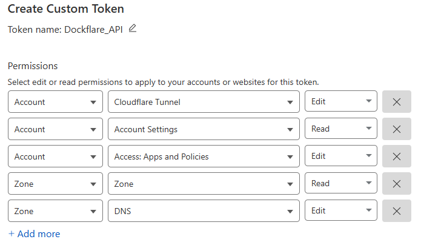

[](https://github.com/ChrispyBacon-dev/baconflip)
[]()
[](https://en.wikipedia.org/wiki/Central_processing_unit)
[](https://github.com/ChrispyBacon-dev/DockFlare/releases/tag/v1.8.5)
[](https://hub.docker.com/r/alplat/dockflare)
[](https://www.python.org/)
[](https://github.com/ChrispyBacon-dev/dockflare/issues)
[](https://github.com/ChrispyBacon-dev/dockflare/commits/stable)
[](https://github.com/ChrispyBacon-dev/dockflare/commits/stable)


---

## 🚀 What is DockFlare?

DockFlare simplifies Cloudflare Tunnel and Zero Trust Access policy management by using Docker labels for automated configuration, while also providing a powerful web UI for manual service definitions and policy overrides. It enables secure, hassle-free public access to both Dockerized and non-Dockerized applications with minimal direct interaction with Cloudflare. Acting as a dynamic, self-hosted ingress controller, DockFlare offers persistent, UI-driven control over access policies centralizing and streamlining your access management.

<details>
<summary>✨ Key Features</summary>

-   **Unified Cloudflare Tunnel Management**:
    -   Automates Tunnel creation/use & `cloudflared` agent lifecycle (optional internal deployment or external).
-   **Dynamic Ingress via Docker Labels**:
    -   Auto-configures Tunnel ingress & DNS from Docker labels (e.g., `hostname`, `service`, `path`).
    -   Supports various service types (`http`, `https`, `tcp`, `ssh`, `rdp`, `http_status`).
    -   Controls `no_tls_verify` and `originServerName` (SNI) for origin connections.
-   **Manual Ingress Rule Management**:
    -   Add & manage public hostnames for non-Docker services (e.g., router, NAS) via Web UI; DockFlare handles Tunnel rules & DNS.
-   **Versatile Access Policy Control (Docker & Manual)**:
    -   Define Cloudflare Access Policies (e.g., `bypass`, `authenticate`, custom JSON) via Docker labels; auto-manages Access Applications.
    -   Web UI to manage/override policies for *any* rule; UI changes persist, override labels, with revert option & clear indicators.
-   **Multi-Hostname & Multi-Zone**:
    -   Supports multiple hostnames (unique targets, zones, policies) per Docker container (indexed labels) or manual rule.
-   **State Persistence & Graceful Deletion**:
    -   Configurable grace period for Docker rule cleanup; persists all managed rules, Access App IDs, & UI overrides in `state.json`.
-   **Intelligent Reconciliation**:
    *   Continuously syncs Docker, manual entries, & saved state (respecting UI overrides) with Cloudflare (Tunnel, DNS, Access Apps); shows UI progress.
-   **Comprehensive Web UI (DaisyUI)**:
    -   **Dashboard**: Tunnel/agent status & controls.
    -   **Unified Rule List**: View/manage all rules (Docker & manual) with status, target, Access Policy (Cloudflare links, UI override badges), & delete options.
    -   **Easy Manual Entry**: Add non-Docker services via UI.
    -   **Account Tools**: View account tunnels/DNS.
    -   **Real-time Logs & Themes**: SSE activity logs & multiple UI themes.
-   **Secure & Robust**:
    -   Content Security Policy (CSP), API retries, and error reporting.

[Learn more on the GitHub Wiki](https://github.com/ChrispyBacon-dev/DockFlare/wiki)

</details>

---

## 🖼️ Web UI Preview



---

## ⚙️ Getting Started

<details>
<summary>📋 Important Prerequisites for Cloudflare API</summary>

- Docker: [Install Docker](https://docs.docker.com/engine/install/)
- Docker Compose: [Install Docker Compose](https://docs.docker.com/compose/install/)
- Cloudflare Account with:
  - API Token with Account:Cloudflare Tunnel:Edit, Account:Account Settings:Read, Account:Access: Apps and Policies:Edit, Zone:Zone:Read, Zone:DNS:Edit
  
  *(Note: Account Settings Read is planned for future features, not strictly required for current core functionality.)*
  - Account ID (found in Cloudflare Dashboard → Overview)
  - Zone ID (found in Cloudflare Dashboard → Overview for your primary domain)

</details>

### 🚀 Quick Start (Docker Compose)

1.  **Create `docker-compose.yml`**:
    ```yaml
    # Your docker-compose.yml content
    version: '3.8'
    services:
      dockflare:
        image: alplat/dockflare:stable # Or :unstable for the latest features
        container_name: dockflare
        restart: unless-stopped
        ports:
          - "5000:5000"
        env_file:
          - .env
        environment:
          - STATE_FILE_PATH=/app/data/state.json
          - TZ=Europe/Zurich # Set your timezone
        volumes:
          - /var/run/docker.sock:/var/run/docker.sock:ro
          - dockflare_data:/app/data
        networks:
          - cloudflare-net
        # Optional labels to expose DockFlare itself via DockFlare
        # labels:
        #   - cloudflare.tunnel.enable=true
        #   - cloudflare.tunnel.hostname=dockflare.yourdomain.tld
        #   - cloudflare.tunnel.service=http://dockflare:5000
        #   - cloudflare.tunnel.access.policy=authenticate # Example: require login
    volumes:
      dockflare_data:
    networks:
      cloudflare-net:
       name: cloudflare-net
    ```

2.  **Create `.env` File**:
    Copy `env.example` to `.env` and fill in your details.
    <details>
    <summary>📄 Example `.env` content (Click to expand)</summary>

    ```dotenv
    # === REQUIRED CLOUDFLARE CREDENTIALS ===
    CF_API_TOKEN=your_cloudflare_api_token_here
    CF_ACCOUNT_ID=your_cloudflare_account_id_here
    
    # Default Cloudflare Zone ID (Recommended)
    # If not set, cloudflare.tunnel.zonename label is REQUIRED for all services.
    CF_ZONE_ID=your_default_cloudflare_zone_id_here
    
    # === TUNNEL CONFIGURATION ===
    # Name for the Cloudflare Tunnel managed by DockFlare
    # (Required if NOT using an external cloudflared instance)
    TUNNEL_NAME=DockFlare-Tunnel
      
    # === DOCKFLARE BEHAVIOR & CUSTOMIZATION ===
    LABEL_PREFIX=cloudflare.tunnel
    GRACE_PERIOD_SECONDS=28800
    CLEANUP_INTERVAL_SECONDS=300
    AGENT_STATUS_UPDATE_INTERVAL_SECONDS=10
    # STATE_FILE_PATH=/app/data/state.json # Usually set in docker-compose
    SCAN_ALL_NETWORKS=false
    CLOUDFLARED_NETWORK_NAME=cloudflare-net
    # TUNNEL_DNS_SCAN_ZONE_NAMES=extradomain.com,another-zone.net
    
    # === PERFORMANCE & RESOURCE MANAGEMENT ===
    MAX_CONCURRENT_DNS_OPS=3
    # RECONCILIATION_BATCH_SIZE=3 # Placeholder
    ```
    *Refer to `env.example` for a full list of options and detailed comments.*
    </details>

3.  **Run DockFlare**:
    ```bash
    docker compose up -d
    ```

4.  **Access the Web UI**: Open `http://your-server-ip:5000` in your browser.

---

## 🏷️ How It Works & Labeling Containers

DockFlare listens for Docker container events.
- **Label-First for Initial Setup**: By labeling your containers, DockFlare initially configures Cloudflare Tunnel ingress rules, DNS records, and associated Cloudflare Zero Trust Access Applications.
- **UI for Dynamic Overrides**: The Web UI allows you to dynamically change Access Policies for individual services. These UI changes take precedence over container labels and are persistent.
- **Revert Option**: You can always revert a UI-managed Access Policy back to be controlled by the container's labels via the Web UI.

<details>
<summary>📝 Labeling Your Containers (Examples & Details)</summary>

DockFlare supports two approaches for labeling containers:

#### 1. Standard Labels (Single Domain per Service)

To expose a service through DockFlare, add the following labels to your container:

```yaml
services:
  my-service:
    image: nginx:latest
    labels:
      # Enable DockFlare management for this container
      - "cloudflare.tunnel.enable=true" 
      
      # The public hostname to expose
      - "cloudflare.tunnel.hostname=my-service.example.com"
      
      # The internal service address (protocol://container_name_or_ip:port)
      # Service type (http, https, tcp, ssh, rdp, http_status) is inferred from the prefix.
      - "cloudflare.tunnel.service=http://my-service:80" 
      
      # Optional: Specify a URL path. Only requests to hostname/path will match.
      # - "cloudflare.tunnel.path=/app"
      
      # Optional: Specify a different Cloudflare Zone for this hostname
      # - "cloudflare.tunnel.zonename=another.example.com"
      
      # Optional: Disable TLS verification if your internal service uses HTTP or a self-signed cert
      # - "cloudflare.tunnel.no_tls_verify=true"

      # Optional: Specify Origin Server Name (SNI) for TLS connection to origin
      # - "cloudflare.tunnel.originsrvname=internal.service.local" 
    networks:
      - cloudflare-net 
```

#### 2. Indexed Labels (Multiple Hostnames/Services from One Container)

To expose multiple hostnames or services from a single container, use indexed labels:

```yaml
services:
  multi-host-app:
    image: my-custom-app:latest
    labels:
      - "cloudflare.tunnel.enable=true"
      
      # First hostname configuration
      - "cloudflare.tunnel.0.hostname=app1.example.com"
      - "cloudflare.tunnel.0.service=http://multi-host-app:8080" # Points to port 8080
      - "cloudflare.tunnel.0.path=/frontend" # Path for this specific hostname/service
      # - "cloudflare.tunnel.0.originsrvname=app1-sni.internal" 
      # - "cloudflare.tunnel.0.access.policy=authenticate" 
      
      # Second hostname configuration
      - "cloudflare.tunnel.1.hostname=api.example.com"
      - "cloudflare.tunnel.1.service=tcp://multi-host-app:3000" # Example of TCP service
      # - "cloudflare.tunnel.1.path=/rpc" # Path might be less common for TCP but possible
      # - "cloudflare.tunnel.1.zonename=otherexample.com" 
      # - "cloudflare.tunnel.1.no_tls_verify=true" # Not typical for TCP but shown as an option
      # - "cloudflare.tunnel.1.originsrvname=api-sni.internal"
      
      # Note: Default service/path/originsrvname can also be set without index,
      # and indexed entries will fall back to them if not specified.
    networks:
      - cloudflare-net
```
> **Note**: Index numbers must be sequential starting from `0` (e.g., `0`, `1`, `2`). Any gap will stop further processing of indexed labels for that container. Each indexed entry is treated as a separate rule.

</details>

<details>
<summary>🛡️ Access Policy Labels (Zero Trust)</summary>

These labels define the *initial* Cloudflare Access Policy for an exposed `hostname`. UI changes persist and override these labels unless "Reverted to Labels".

| Label                                   | Description                                                                                                                                                                                             | Default                | Example                                                                                   |
| :-------------------------------------- | :------------------------------------------------------------------------------------------------------------------------------------------------------------------------------------------------------ | :--------------------- | :---------------------------------------------------------------------------------------- |
| `{prefix}.access.policy`                | Type: `bypass` (public app), `authenticate` (IdP login), `default_tld` (inherits from `*.domain.com` policy, no specific app created). If unset, service is public (no Access App).                  | (None/Public)          | `cloudflare.tunnel.access.policy="authenticate"`                                        |
| `{prefix}.access.name`                  | Custom name for the Cloudflare Access Application.                                                                                                                                                      | `DockFlare-{hostname}` | `cloudflare.tunnel.access.name="My Web App Access"`                                      |
| `{prefix}.access.session_duration`      | Session duration (e.g., `24h`, `30m`).                                                                                                                                                                | `24h`                  | `cloudflare.tunnel.access.session_duration="1h"`                                         |
| `{prefix}.access.app_launcher_visible`  | If `"true"`, app is visible in Cloudflare App Launcher.                                                                                                                                                  | `false`                | `cloudflare.tunnel.access.app_launcher_visible="true"`                                   |
| `{prefix}.access.allowed_idps`          | Comma-separated IdP UUIDs. If `authenticate` & unset, allows any account IdP.                                                                                                                             | (Account Default)      | `cloudflare.tunnel.access.allowed_idps="<IdP_UUID_1>,<IdP_UUID_2>"`                      |
| `{prefix}.access.auto_redirect_to_identity` | If `"true"`, auto-redirects to IdP login.                                                                                                                                                             | `false`                | `cloudflare.tunnel.access.auto_redirect_to_identity="true"`                              |
| `{prefix}.access.custom_rules`          | JSON string array of [Cloudflare Access Policy rules](https://developers.cloudflare.com/api/operations/access-policies-create-an-access-policy). Overrides basic `access.policy` decisions.         | (None)                 | `'...=[{"email":{"email":"user@example.com"},"action":"allow"},{"action":"block"}]'` |

**Example of Access Policy Labels:**
```yaml
labels:
  - "cloudflare.tunnel.enable=true"
  - "cloudflare.tunnel.hostname=secure-app.example.com"
  - "cloudflare.tunnel.service=http://my-secure-app:8080"
  - "cloudflare.tunnel.access.policy=authenticate"
  - "cloudflare.tunnel.access.session_duration=8h"
  # - "cloudflare.tunnel.access.allowed_idps=YOUR_GITHUB_IDP_UUID_HERE" 
```
This creates an Access Application named "DockFlare-secure-app.example.com" requiring authentication with an 8-hour session.

</details>

---

## 🔧 Advanced Configuration & Usage

<details>
<summary>⚙️ All Environment Variables</summary>

| Variable                          | Description                                                                                               | Default                          |
| :-------------------------------- | :-------------------------------------------------------------------------------------------------------- | :------------------------------- |
| `CF_API_TOKEN`                    | Cloudflare API token                                                                                      | **(Required)**                   |
| `CF_ACCOUNT_ID`                   | Cloudflare account ID                                                                                     | **(Required)**                   |
| `CF_ZONE_ID`                      | Default/fallback Cloudflare zone ID.                                                                      | (None - `zonename` label needed) |
| `TUNNEL_NAME`                     | Name for the Cloudflare tunnel (if DockFlare manages it).                                                 | `dockflared-tunnel`              |
| `GRACE_PERIOD_SECONDS`            | Time (sec) before removing rules after container stops.                                                   | `28800` (8 hours)                |
| `CLEANUP_INTERVAL_SECONDS`        | Interval (sec) for checking expired rules.                                                                | `300` (5 minutes)                |
| `AGENT_STATUS_UPDATE_INTERVAL_SECONDS` | Interval (sec) to update managed agent status.                                                       | `10`                             |
| `LABEL_PREFIX`                    | Prefix for Docker labels.                                                                                 | `cloudflare.tunnel`              |
| `USE_EXTERNAL_CLOUDFLARED`        | Set to `true` to use an existing `cloudflared` agent.                                                     | `false`                          |
| `EXTERNAL_TUNNEL_ID`              | Tunnel ID for external `cloudflared` mode.                                                                | (Required if external is true)   |
| `SCAN_ALL_NETWORKS`               | Scan containers across all Docker networks.                                                               | `false`                          |
| `CLOUDFLARED_NETWORK_NAME`        | Docker network for DockFlare's managed `cloudflared` agent.                                               | `cloudflare-net`                 |
| `STATE_FILE_PATH`                 | Path inside container for state persistence (`state.json`).                                               | `/app/data/state.json`           |
| `TUNNEL_DNS_SCAN_ZONE_NAMES`      | Comma-separated additional Zone NAMES for UI DNS scan (e.g., `another.com,mydomain.org`).                  | (None)                           |
| `MAX_CONCURRENT_DNS_OPS`          | Limits simultaneous DNS API calls during reconciliation.                                                  | `3`                              |
| `RECONCILIATION_BATCH_SIZE`       | (Placeholder for future) DNS records to process per batch.                                                | `3`                              |
| `ACCOUNT_EMAIL_CACHE_TTL`         | (Internal) How long to cache the account email (seconds).                                                   | `3600` (1 hour)                  |
| `TZ`                              | Set timezone for the container, e.g. `America/New_York`. Affects log timestamps.                            | (System Default)                 |

</details>

<details>
<summary>🔄 External `cloudflared` Mode & Switching</summary>

> [!CAUTION]
> **ADVANCED USERS ONLY - HIGH POTENTIAL FOR MISCONFIGURATION**
>
> External `cloudflared` mode is powerful but requires a **deep understanding of Docker networking and Cloudflare Tunnels.** Misconfiguration can easily lead to services being unreachable or DockFlare being unable to manage resources correctly.
>
> **Proceed with extreme caution and only if you are comfortable managing `cloudflared` and Docker network configurations independently.** This mode is **not recommended** for users new to Docker or Cloudflare Tunnels.

DockFlare can integrate with an existing `cloudflared` tunnel that you manage completely separately (i.e., not started or configured by DockFlare). In this mode, DockFlare focuses on DNS and Cloudflare Access Application management for that tunnel.

**Critical Prerequisite: Docker Network Configuration**

*   For DockFlare to successfully interact with your services when using an external `cloudflared` tunnel, **all relevant containers (DockFlare itself, your target application containers, and potentially your externally managed `cloudflared` agent if it needs to resolve services by Docker DNS) must share a common Docker network and be able to communicate.**
*   You are responsible for ensuring that the "Service Address" you define in DockFlare (via labels or UI) is resolvable and reachable from your *externally managed* `cloudflared` agent.
*   Incorrect network setup is the most common source of issues in this mode.

**To Use External Mode:**

1.  Set `USE_EXTERNAL_CLOUDFLARED=true` in your `.env` file.
2.  Set `EXTERNAL_TUNNEL_ID` in your `.env` file to your existing tunnel's UUID.
    <details>
    <summary>How to Find Your Existing Tunnel ID</summary>

    1.  Log in to the [Cloudflare Dashboard](https://dash.cloudflare.com).
    2.  Navigate to **Zero Trust** -> **Access** -> **Tunnels**.
    3.  Select your desired pre-existing tunnel.
    4.  The Tunnel ID (a UUID) is displayed on the tunnel's overview page and is also present in the URL.
    </details>

**DockFlare's Behavior in External Mode:**

*   ✅ **WILL** create/update/delete CNAME DNS records in your configured Cloudflare zones, pointing to your `EXTERNAL_TUNNEL_ID`.
*   ✅ **WILL** create/update/delete Cloudflare Access Applications based on Docker labels or UI interactions for services it manages.
*   ❌ **WILL NOT** start, stop, or manage a `cloudflared` agent Docker container. You are fully responsible for the lifecycle and configuration of your `cloudflared` agent.
*   ❌ **WILL NOT** modify the tunnel's ingress rules via the Cloudflare API. Ingress routing (which public hostnames/paths map to which internal services) must be configured directly in your externally managed `cloudflared` agent's configuration file (e.g., `config.yml`). DockFlare assumes your external `cloudflared` agent is already correctly routing traffic for the hostnames it manages DNS for.

> [!WARNING]
> **Authoritative DNS Management in External Mode:**
> When `USE_EXTERNAL_CLOUDFLARED=true`, DockFlare assumes it has **authoritative control** over CNAME DNS records in the specified Cloudflare zones that point to the `EXTERNAL_TUNNEL_ID`.
>
> *   It **may remove CNAME records** it doesn't recognize as actively managed by its current rules if those CNAMEs point to the same `EXTERNAL_TUNNEL_ID` within the monitored zones.
> *   Ensure no other systems or manual configurations are creating CNAMEs for this specific external tunnel in the zones DockFlare monitors, as they might be overwritten or deleted.

**Before Enabling External Mode, Ensure You Can Answer "Yes" To:**

1.  Do I have a `cloudflared` tunnel already running and configured independently of DockFlare?
2.  Does my external `cloudflared` agent's configuration file (`config.yml`) correctly define ingress rules for the services I want DockFlare to manage DNS/Access for?
3.  Are DockFlare, my target application containers, and my external `cloudflared` agent (if resolving services by Docker DNS) all on a shared Docker network that allows them to communicate as needed?
4.  Am I comfortable troubleshooting Docker networking issues independently?
5.  Do I understand that DockFlare will manage DNS records pointing to my external tunnel ID and may remove conflicting ones?

If you cannot confidently answer "yes" to all these questions, using DockFlare's default managed `cloudflared` mode is strongly recommended.

**Switching Modes (e.g., Internal to External):**
This requires careful steps to avoid conflicts.
1. **Stop DockFlare:** `docker compose stop dockflare`
2. **If moving from Internal to External:**
   *   Remove the DockFlare-managed agent: `docker rm -f cloudflared-agent-YOUR_TUNNEL_NAME` (replace `YOUR_TUNNEL_NAME` with the value from your old `.env`).
   *   Consider deleting the old tunnel object and its DNS CNAMEs from the Cloudflare dashboard if you are setting up a brand new external tunnel.
3. **Set up your external `cloudflared` agent** and get its Tunnel ID.
4. **Update `.env`**: Set `USE_EXTERNAL_CLOUDFLARED=true` and `EXTERNAL_TUNNEL_ID`. Clear or comment out `TUNNEL_NAME`.
5. **Optional: Clear Old State:** For a clean switch, you might consider removing the old `state.json` (e.g., `docker volume rm dockflare_data` then `docker volume create dockflare_data`, or delete the file if mapped to host). DockFlare will then rebuild state from active containers.
6. **Start DockFlare:** `docker compose up -d dockflare`
7. **Verify:** Check UI, logs, and Cloudflare dashboard.

</details>

<details>
<summary>🗺️ Multi-Zone DNS Management</summary>

DockFlare handles services across multiple Cloudflare zones (domains).

1.  **Container-Specific Zone (Label):**
    Use `cloudflare.tunnel.zonename="yourdomain.com"` on a container (or indexed entry) to specify its zone. DockFlare resolves the Zone ID automatically.
    ```yaml
    labels:
      - "cloudflare.tunnel.0.hostname=app.customdomain.com"
      - "cloudflare.tunnel.0.service=http://my-service:80"
      - "cloudflare.tunnel.0.zonename=customdomain.com" 
    ```
2.  **Default Zone (Environment Variable):**
    Set `CF_ZONE_ID` in your `.env` file. This is used if a `zonename` label isn't provided for a rule.
3.  **UI DNS Scan (Multiple Zones):**
    To see DNS records for a tunnel across multiple zones you own (in the "All Cloudflare Tunnels" UI section), set `TUNNEL_DNS_SCAN_ZONE_NAMES` in your `.env` with a comma-separated list of zone *names* (e.g., `TUNNEL_DNS_SCAN_ZONE_NAMES=domain1.com,another.org`). `CF_ZONE_ID`'s domain is included automatically if set.

</details>

<details>
<summary>🔍 Troubleshooting & Health Checks</summary>

**Common Issues:**
- **Log Stream Not Working**: Ensure browser supports SSE. Check for network filtering or reverse proxy issues (ensure SSE/long-polling is allowed).
- **Container Not Detected**:
    - Verify correct labels (prefix, enable, hostname, service).
    - Container network accessible by DockFlare/agent (or `SCAN_ALL_NETWORKS=true`).
    - Valid hostname and service format (e.g., `http://host:port`).
- **Cloudflare API Errors**: Check `CF_API_TOKEN` permissions, `CF_ACCOUNT_ID`, and `CF_ZONE_ID`.

**Debugging:**
- View logs in DockFlare Web UI or via `docker logs dockflare`.

**Health Checks:**
- **DockFlare App Ping**: `http://<dockflare_host>:5000/ping`
- **Cloudflare Connectivity (via Tunnel)**: Access `http://<your_dockflare_public_hostname>/cloudflare-ping` (if you've exposed DockFlare itself) to check headers from Cloudflare.

</details>

---
## ✨ Star History

[](https://www.star-history.com/#ChrispyBacon-dev/DockFlare&Date)

## 🤝 Contributing

Contributions are welcome! Please see [CONTRIBUTING.md](CONTRIBUTING.md) or open an issue/PR.

## 📜 License

DockFlare is licensed under the GNU General Public License v3.0. See [LICENSE.MD](LICENSE.MD) for details.